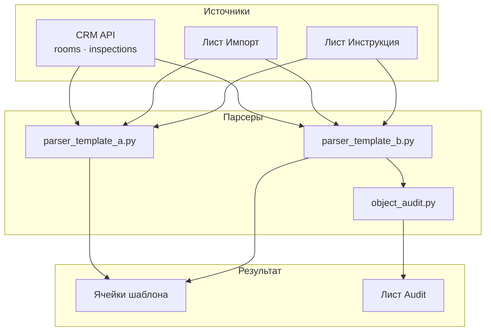
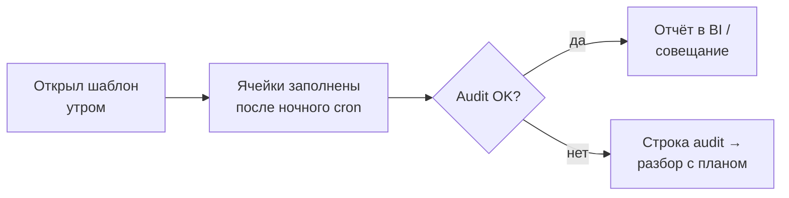
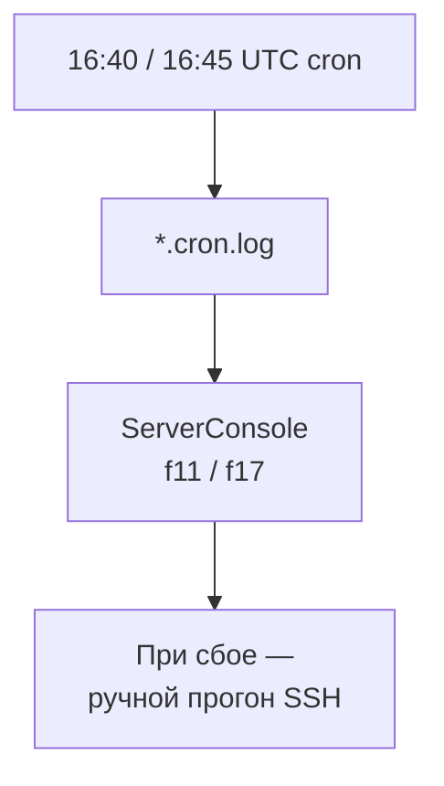

# Парсеры отчётов в Google Sheets (шаблон A / B)

Короче: **CRM → сверка с листом «Импорт» → ячейки шаблона + audit**, два разных отчёта, один подход.

Задача: тяжёлые шаблоны МРК в таблице — сотни ячеек. Руками копировать формулы и тянуть iFlat каждый вечер нереально. Нужны два независимых парсера под разные дома и правила.

---

## Что сделано

- **parser_template_a.py** / **parser_template_b.py** — параллельные ветки, разные якоря и лист Импорт.
- **object_audit.py** — флаги по каждому помещению, лист audit для сверки.
- **Batch update в Sheets** — gspread, без ручного копирования.
- **Отдельный cron** на каждый шаблон + ручной запуск из Telegram-пульта.

---

## Фишки и удобство

| Фишка | Зачем |
|-------|-------|
| Лист «Инструкция» | Правила в таблице, не только в коде |
| Audit-лист | Видно, где расхождение с ожиданием |
| Раздельный cron | f11 и f17 не блокируют друг друга |
| Timeout 2h в пульте | Длинный прогон не обрывается молча |
| OAuth через env | Без пароля в git |

**Плюс:** один service account на оба парсера — меньше ключей в обороте.

---

## Схема данных



---

## Процесс пользователя



**Администратор:**



---

## Стек

| Слой | Технология |
|------|------------|
| Источник | CRM REST + листы Sheets |
| ETL | Python 3, gspread |
| Параллелизм | concurrent.futures |
| Расписание | cron |
| Пульт | ServerConsoleBot |

---

## Структура репозитория

```
README.md
LICENSE
.gitignore
parser_template_a.py      — шаблон A
parser_template_b.py      — шаблон B
object_audit.py           — audit по объектам
crm_auth.py               — секреты через env
docs/                     — PARSING_RULES, DATA-SCHEMA, DIAGRAMS.md
examples/                 — crm_secrets, service-account.example
```

---

## Быстрый старт

```bash
export CRM_SECRETS_JSON="..."
export GOOGLE_SERVICE_ACCOUNT_JSON="..."
python3 parser_template_b.py
```

Перед git: убрать хардкод OAuth; ID листов — в `.example` конфиг.
